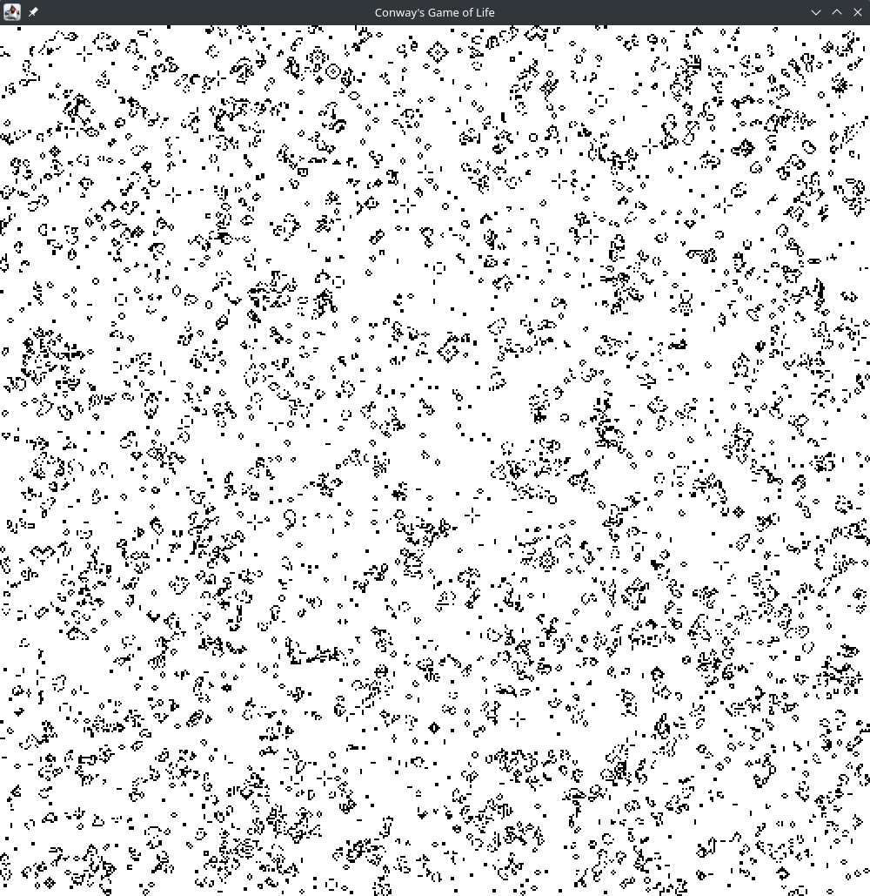
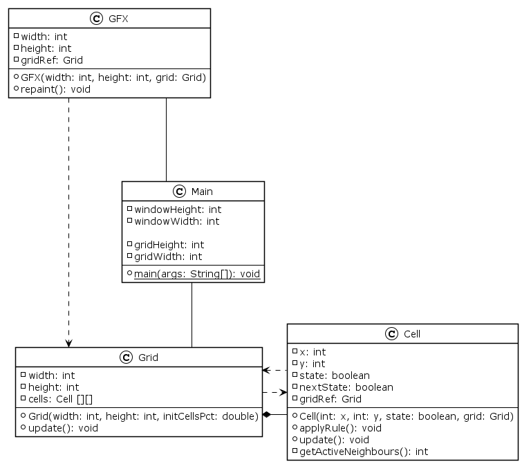

# Conway's Game of Life Cellular Automata - Java

This is a basic implementation of the cellular automaton John Conway's Game.
I made it to practice using Object-Oriented Design principles when starting
out with Java just experiment and play around a bit. It initialises a board
with randomly placed cells and begins the simulation.

<p align="center"></p>

## Rules
The rules of the simulation are rather simple, below is an excerpt from this [Wikipedia page](https://en.wikipedia.org/wiki/Conway%27s_Game_of_Life#Rules).
> The universe of the Game of Life is an infinite, two-dimensional orthogonal grid of square
> cells, each of which is in one of two possible states, live or dead (or populated and unpopulated,
> respectively). Every cell interacts with its eight neighbours, which are the cells that are
> horizontally, vertically, or diagonally adjacent. At each step in time, the following transitions occur:
> 1. Any live cell with fewer than two live neighbours dies, as if by underpopulation.
> 2. Any live cell with two or three live neighbours lives on to the next generation.
> 3. Any live cell with more than three live neighbours dies, as if by overpopulation.
> 4. Any dead cell with exactly three live neighbours becomes a live cell, as if by reproduction.
>
> These rules, which compare the behaviour of the automaton to real life, can be condensed into the following:
>
> 1. Any live cell with two or three live neighbours survives.
> 2. Any dead cell with three live neighbours becomes a live cell.
> 3. All other live cells die in the next generation. Similarly, all other dead cells stay dead.
>
> The initial pattern constitutes the seed of the system. The first generation is created by applying
> the above rules simultaneously to every cell in the seed, live or dead; births and deaths occur simultaneously,
> and the discrete moment at which this happens is sometimes called a tick. Each generation is a pure
> function of the preceding one. The rules continue to be applied repeatedly to create further generations.

## Design
This simulation was based around the principles of object-oriented programming, so functionality is separated into
different classes as can be seen in the UML diagram below which was generated using PlantUML (source: `diagram.plantuml`).

<p align="center"></p>

### Configurable Parameters
It is possible to change the pixel dimensions of the canvas, as well as the cell count of the grid.
As can be seen in the UML diagram, the `Main.java` class contains 4 constants: `WINDOW_WIDTH`, `WINDOW_HEIGHT`,
`GRID_WIDTH`, and `GRID_HEIGHT`. These can all be modified to change the appearance of the canvas.
```java
private final static int WINDOW_WIDTH = 1000;
private final static int WINDOW_HEIGHT = 1000;
private final static int GRID_WIDTH = 500;
private final static int GRID_HEIGHT = 500;
```

It is also possible to change the percentage of initial active cells in the `Grid.java` class, by modifying the
`activeCellsPct` value in the constructor. The tick period can also be changed.
This can be done in the `Main.java` class as shown:
```java
public static void main(String[] args) {
  Grid grid = new Grid(GRID_WIDTH, GRID_HEIGHT, 0.2);    // <-- the percentage is here
  GFX gfx = new GFX(WINDOW_WIDTH, WINDOW_HEIGHT, grid);  //     (0.2 or 20% by default)
  while(true) {			
    try {			
      TimeUnit.MILLISECONDS.sleep(20);    // <-- tick period (default 20ms)
    } catch(InterruptedException e) {}	

    grid.update();
    gfx.repaint();
  }
}
```
### Note
Using OOP for an automata is not exaclty the most efficient way, this program was just made to illustrate
how OOP can be used for such a task. I made this as a side project as part of my IB Computer Science course
in highschool.

## Building and Running an Executable
This project was made in the Eclipse IDE and used standard Java libraries so there should not be any problem with
importing the files into an Eclipse project, building and running.
